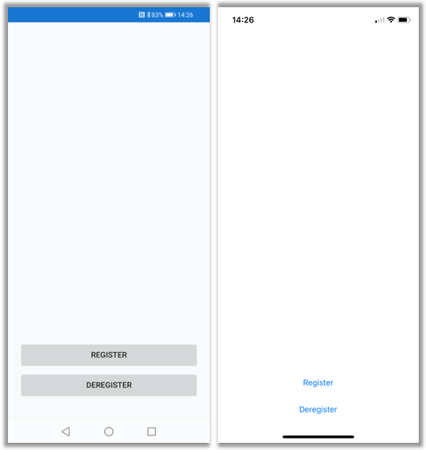
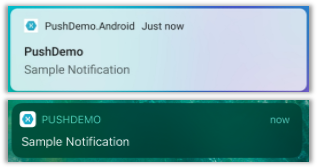
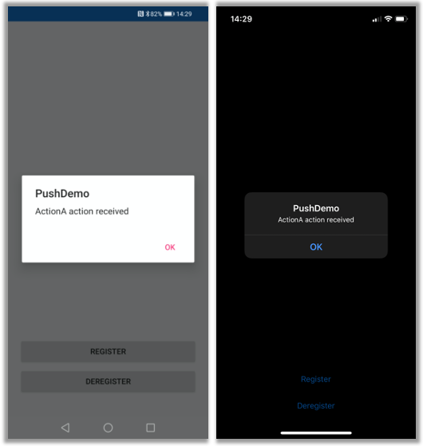

# Push notifications using Azure Notification Hubs via a backend service

Sample demonstrating how to use [Azure Notification Hubs](https://docs.microsoft.com/en-us/azure/notification-hubs/notification-hubs-push-notification-overview) via a backend service to send push notifications to **Android** and **iOS** applications.  

An [ASP.NET Core Web API](https://dotnet.microsoft.com/apps/aspnet/apis) backend is used to handle [device registration](https://docs.microsoft.com/en-us/azure/notification-hubs/notification-hubs-push-notification-registration-management#what-is-device-registration) on behalf of the client using the latest and best [Installation](https://docs.microsoft.com/en-us/azure/notification-hubs/notification-hubs-push-notification-registration-management#installations) approach via the [Notification Hubs SDK for backend operations](https://www.nuget.org/packages/Microsoft.Azure.NotificationHubs/), as shown in the guidance topic [Registering from your app backend](https://docs.microsoft.com/en-us/azure/notification-hubs/notification-hubs-push-notification-registration-management#registration-management-from-a-backend). 

A cross-platform [Xamarin.Forms](https://dotnet.microsoft.com/apps/xamarin/xamarin-forms) application is used to demonstrate the use of the backend service using explicit register/deregister actions. 

Alert style notifications will appear in the notification center (when the app is stopped or in the background). 

If a notification contains an action and is received when app is in the foreground, or where an alert-style notification is used to launch the application from notification center, a message is presented identifying the action specified.

> [!NOTE]
> You would typically perform the registration (and deregisration) actions during the appropriate point in the application lifecycle (or as part of your first-run experience perhaps) without explicit user register/deregister inputs. However, this example will require explicit user input to allow this functionality to be explored and tested more easily. The notifications are defined client-side using [custom templates](https://docs.microsoft.com/azure/notification-hubs/notification-hubs-templates-cross-platform-push-messages) in this case but could be handled server-side in future. 

## Browse code

- [Backend Service (ASP.NET Core)](https://github.com/xamcat/mobcat-samples/tree/master/notification_hub_backend_service/src/azure)  
- [Mobile App (Xamarin.Forms)](https://github.com/xamcat/mobcat-samples/tree/master/notification_hub_backend_service/src/xamarin)  